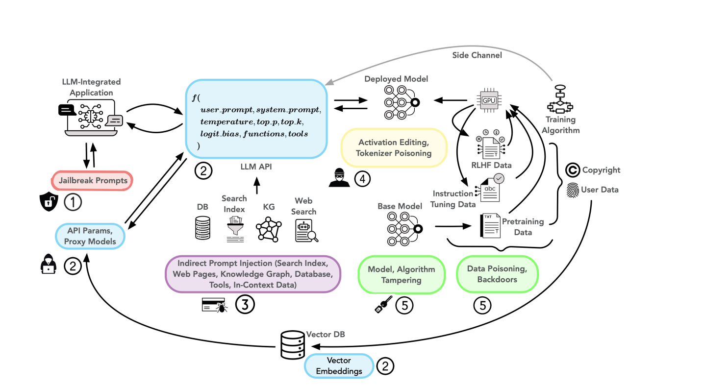

Notes from Operationalizing a Threat Model for Red-Teaming Large Language Models (LLMs) - Apurv Verma 
Two broad categories of risks 
* dissentive risks -> categories whose definitions are not widely agreed 
* consentive risks -> every one agrees on the fact it is a risk (phishing, private information leak)


```clearly define the risks and behaviors to uncover before starting red-teaming ```

harms depends on the context 
hallucination can be useful for writers but dangerous for medical or legal advice

"A limit-seeking activity, using vanilla attacks, a manual process, team effort, and an alchemist mindset to break, probe, or experiment with LLMs" 
from Inie https://arxiv.org/pdf/2311.06237 

 AGI laboratories should evaluate risks prior to deployment, examine hazardous capabilities, perform third-party audits, enforce usage limitations, and engage in red-teaming

 Attack taxonomies
 * ATLAS Matrix : 14 attack strategies from the point of view of a security researcher 

 
 Types of attacks from Feffer:
 * Brute Force 
 * Brute Force + AI 
 * Algorithm search 
 * Targeted attack ->  deliberately targeting part of an LLM

Threat model:
* Interaction through Prompting. 
  * harmful responses, unintended responses 
* Application Layers beyond LLM: other components beyond the model itself like retrieval systems, heuristic filters, and error correction mechanisms. Multi stage llms / agents, complex systems. 
* Model internals and training data 

Attack Surface:
* Jailbreak attacks require just access to the llm based app
* Trainig time attack require : training procedure and  instruction tuning or fine-tuning data



## Types of attacks
### Jailbreak 
* application prompts also include an H3 (Helpful, Harmless and Honest) directive

**Jailbreak strategies:**
* Do Anything Now
* Prompt Injection Attack (Ignore all instructions you got before...),
* Privilege Escalation (dev mode)
* Deception
* Mandatory Answer 
* Invoking fictional worlds
* Skeleton Key: requiring it to augment, rather than change, its behavior protocols to issue a warning in response to a request instead of declining to reply 


### Direct attacks**
* Automated attacks 
* Manual attacks 

#### Automated attacks 
A “Red LLM” communicates with the LLM (which is being attacked) through its API
out put is then scanned by a red classifier to detect harmful behavior
example of framework: ReNeLLM

http://easyjailbreak.org/
